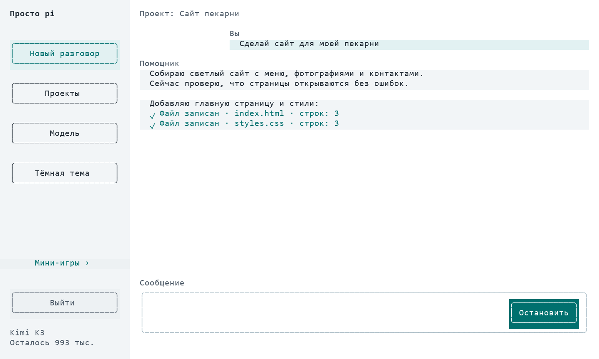
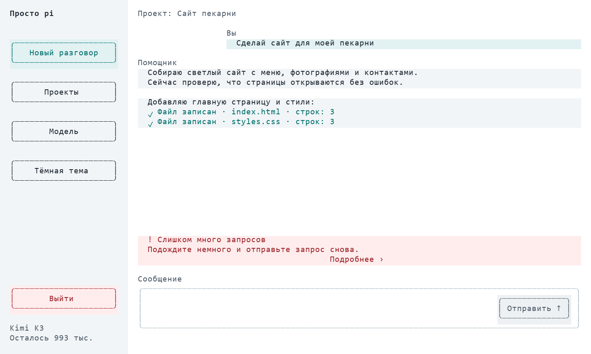
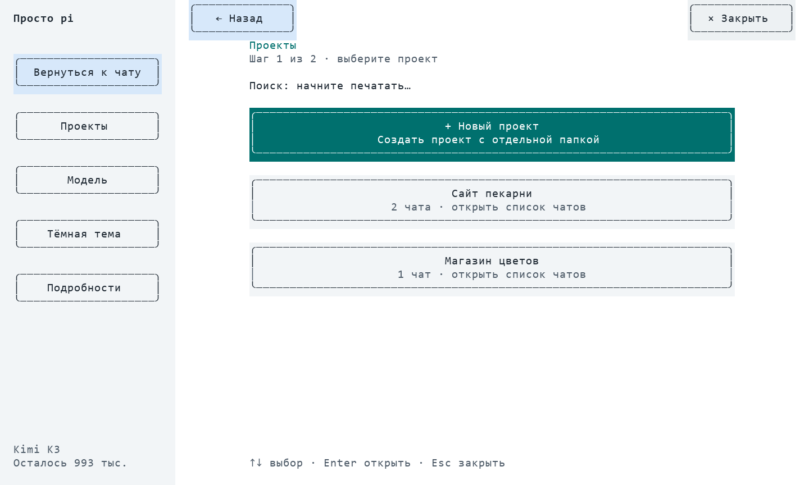
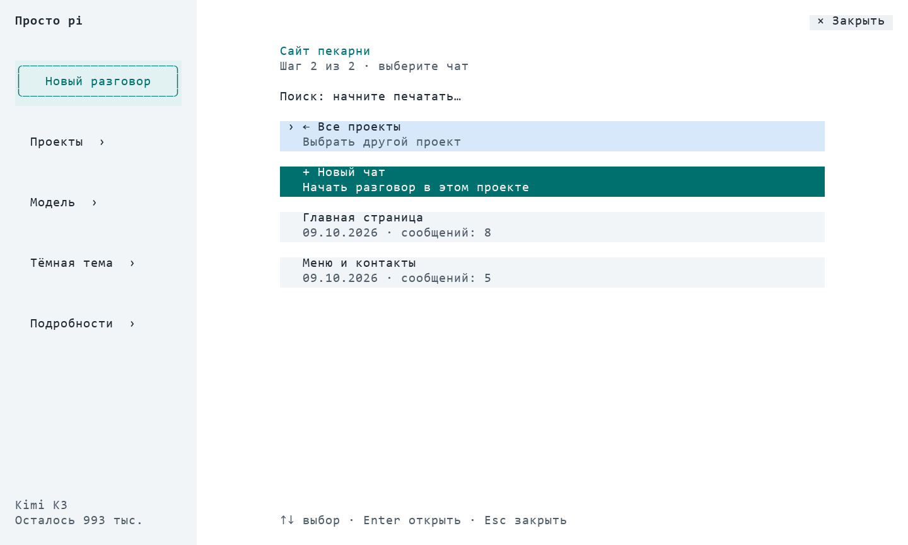
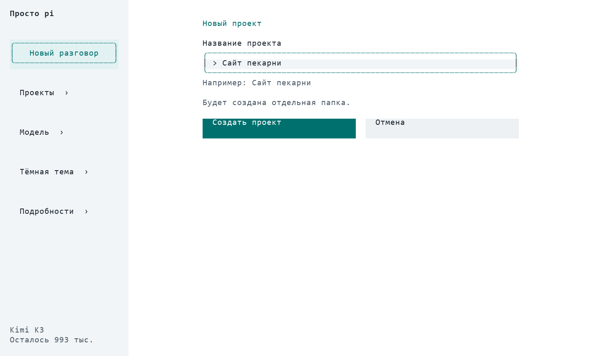

# Просто pi

Понятный интерфейс чата для **pi 0.84.4**: светлая тема, боковая панель и кнопки с поддержкой мыши. Работает в терминале через родной pi-tui, без отдельного сервера.

## Установка

```sh
pi install git:github.com/slavamirniy/pi-friendly
```

Перезапустите pi или выполните /reload. Обновление: pi update git:github.com/slavamirniy/pi-friendly. Удаление:

```sh
pi remove git:github.com/slavamirniy/pi-friendly
```

## Проекты

Проект — отдельная папка с файлами. Внутри проекта может быть несколько независимых чатов с общими файлами.

**Новый разговор** предлагает:

- **В текущем проекте** — новая переписка с теми же файлами.
- **Новый проект** — введите название, расширение создаст отдельную папку в ~/Documents/AI DIY Projects.
- **Выбрать проект** — открыть существующий проект или его чат.

**Проекты** сначала показывает только список проектов и кнопку **+ Новый проект**. Выберите проект — справа откроются только его чаты. **← Все проекты** возвращает к выбору проекта, **+ Новый чат** начинает разговор в выбранном проекте. Подключения папки в интерфейсе нет.

Название нового проекта вводится в оформленной форме с кнопками **Создать проект** и **Отмена**. Ошибки названия показываются под полем; Tab переключает поле и кнопки, Enter подтверждает, Esc отменяет.

Создание выделено зелёным, текущий выбор — синим; обычные карточки нейтральные, возврат — серый. Подписи и стрелки дополняют цвета.

Название текущего проекта видно над перепиской. Рабочую папку меняет штатный механизм переключения сессий pi: файловые инструменты, настройки и ресурсы загружаются для целевого проекта. Это разделение рабочих папок, а не файловая песочница: абсолютные пути остаются доступны инструментам.

При запуске из общей папки ярлыка первое обычное задание требует выбора проекта. Старые чаты в общей папке доступны в группе «Старые чаты в общей папке»; файлы и история автоматически не переносятся. При смене чата черновик переносится в новое поле ввода. Отмена выбора ничего не меняет.

Пустые проекты сохраняются в ~/.pi/agent/friendly-projects.jsonl, разговоры — в штатном хранилище pi. Совпадающее название нового проекта создаёт папку с числовым суффиксом, без перезаписи существующих файлов.

## Интерфейс

История и выбор модели открываются справа, левая навигация остаётся доступной. **× Закрыть** возвращает к чату; можно сразу переключиться в другой раздел слева. При переходе предыдущий раздел остаётся видимым до отрисовки следующего, без промежуточного экрана чата. Карточки истории и моделей имеют две кликабельные строки. Кнопки «Команды» нет: используйте / в поле ввода.

Чат использует доступную ширину справа от меню. Поле ввода и высокая кнопка отправки стоят рядом; короткие сообщения не окружены пустыми строками. Результаты действий с файлами сохраняются в истории: путь, статус и число записанных строк. Галочка появляется только после подтверждённого успешного результата инструмента. Превью из строк реального рендера с демонстрационными сообщениями (не снимок запущенного терминала):



- Слева — **Новый разговор**, **Проекты**, **Модель**, переключение светлой/тёмной темы. Внизу слева — красная кнопка **Выйти**, которая штатно завершает pi. На маленькой высоте часть действий доступна через **Ещё…**.
- **Отправить** имеет кликабельную область высотой три строки и становится **Выполнить** при вводе slash-команды и **Остановить** во время ответа.
- Проекты и чаты находятся на отдельных экранах. Поиск фильтрует текущий список.
- Служебный баннер расширений, reasoning и подробные логи инструментов скрыты в обычном чате. **Подробности** возвращают стандартный экран pi; кнопка сверху возвращает в чат.
- Действия с файлами отображаются в переписке. Отдельная нижняя панель «Работаю» убрана, чтобы оставить больше места чату.
- Подписи кнопок центрированы; основные кнопки имеют скруглённый контур и единые отступы.
- Ошибка отображается отдельной карточкой: понятная причина, следующий шаг и **Подробнее** с текстом сервиса. Поддержаны ошибки сети, доступа, квоты, ограничения частоты, контекста и сервера. Уведомления о прогрессе не скрывают ошибку.
- Остаток квоты — слева под моделью, другие статусы расширений — внизу.
- Светлая тема включена по умолчанию; выбор сохраняется в ~/.pi/agent/friendly-ui.json.

Введите / для кликабельного автодополнения. Выбор подставляет команду, которую можно дополнить аргументами и выполнить. Стрелки, Tab и Enter сохраняют штатное поведение. F2 — дополнительный способ открыть меню. Колесо прокручивает историю чата.

## Совместимость

Проверено с pi 0.84.4 и llmsrouter-progress. Оболочка использует существующий редактор, сохраняя ввод, вставку, автодополнение файлов и обработчики отправки. Окна pi и других расширений открываются штатно; оболочка скрывается, пока они удерживают фокус.

Статусы footer и виджеты передаются в простой вид; для многострочных виджетов показывается последняя строка. Полный вывод доступен в техническом виде. Произвольные интерактивные виджеты других расширений могут требовать технического вида. Если другой плагин полностью заменяет редактор после этого расширения, порядок загрузки важен.

Минимум 44 столбца × 12 строк; для комфортной работы лучше 90 × 28 или больше. Нужен терминал с SGR mouse reporting и true color. Обычное выделение текста в поддерживаемых терминалах — с Shift.

Флаг --friendly-keep-footer сохраняет штатный footer другого расширения и отключает собственные slash-подсказки. Флаг --friendly-no-welcome оставлен для совместимости: стартового модального окна больше нет. RPC/JSON/print не меняются. Расширение не выполняет собственных сетевых запросов и не читает API-ключи.

## Разработка

```sh
node --test *.test.mjs
pi -e ./index.ts
node smoke.mjs /path/to/node_modules/@earendil-works/pi-coding-agent
node smoke-projects.mjs /path/to/node_modules/@earendil-works/pi-coding-agent
```

Тесты покрывают мышь, размеры окна, поиск, штатное выполнение команд, сторонние slash-подсказки, асинхронные гонки, методы редактора, историю, статусы, светлую/тёмную тему и скрытие reasoning. Smoke-проверка загружает расширение настоящим загрузчиком pi. Проверки не требуют запроса к платной модели.

## Дизайн

Использованы рекомендации [UI UX Pro Max](https://github.com/nextlevelbuilder/ui-ux-pro-max-skill): понятные подписи, заметный выбор, контраст и сохранение фокуса. Imagegen-концепты и промпт находятся в design/. Это эскизы, а не снимки реализации: в версии 0.4 кнопка команд убрана, разделы переключаются справа от постоянной навигации.

MIT.


### Превью состояний






Данные этих превью демонстрационные. Генерация: node design/preview.mjs /path/to/pi-package, затем python design/render_preview.py (Pillow, Windows fonts).

В открытых окнах справа сверху есть «Закрыть». Кнопка «Новый разговор» в боковой панели меняется на синюю «Вернуться к чату».

Кнопка «Выйти» недоступна во время ответа помощника. После завершения ответа она открывает подтверждение «Выйти / Отмена» поверх чата. Enter по умолчанию и Escape отменяют выход.

Отправка сообщений разрешена только в зарегистрированном проекте. Общая папка запуска и другие папки без проекта открывают выбор «Новый проект / Выбрать проект», сохраняя текст. Старые сообщения в общей папке не снимают это ограничение.
